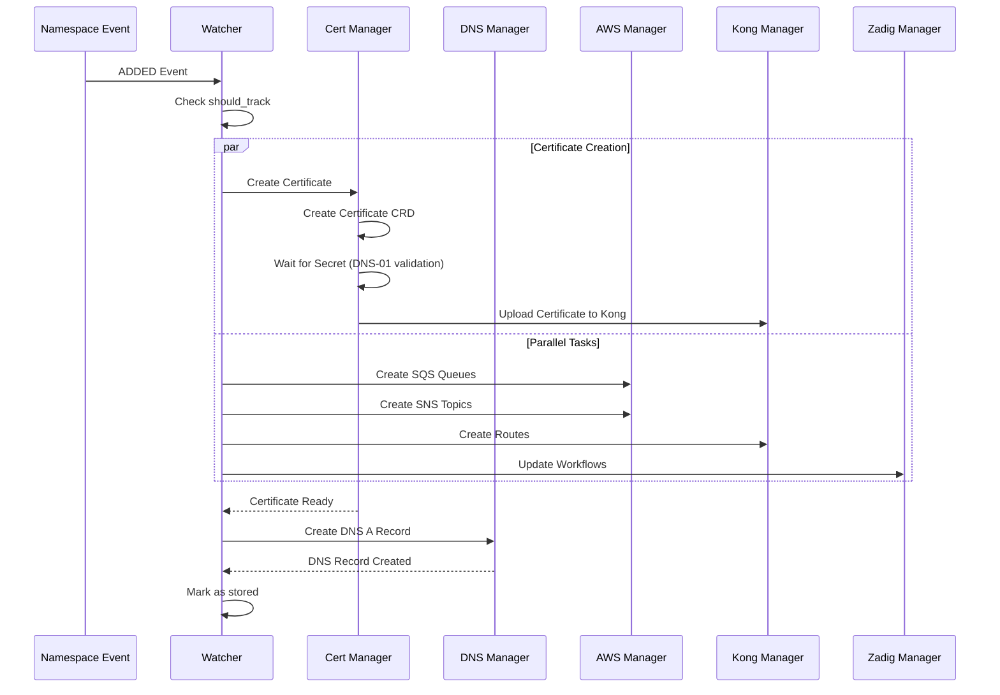

# Execution Flow

## Namespace Creation Sequence

The namespace creation process follows this optimized sequence:

## Key Changes

1. **Certificate First**: Certificate creation starts immediately using cert-manager's DNS-01 validation
2. **Parallel Execution**: AWS, Kong routes, and Zadig updates run in parallel with certificate creation
3. **DNS After Certificate**: DNS A record is created after certificate is ready to ensure proper domain resolution

## Cancellation Support

If a namespace is deleted during creation:

1. All running tasks are cancelled
2. Resources already created are cleaned up in the deletion process
3. The creation is marked as cancelled and deletion is skipped if not fully created

## Resource Dependencies

- **Certificate**: Independent (uses DNS-01 validation)
- **DNS Record**: Depends on Certificate completion
- **AWS Resources**: Independent
- **Kong Routes**: Independent
- **Zadig Workflows**: Independent

This ensures maximum parallelization while respecting necessary dependencies.